# MCP Apps with FastMCP — Architecture & Development Guide

> A practical reference for building interactive MCP Apps using FastMCP v3.0.0rc2 with Svelte frontends.

---

## Table of Contents

1. [What Are MCP Apps?](#1-what-are-mcp-apps)
2. [Architecture](#2-architecture)
3. [Detailed Lifecycle Flow](#3-detailed-lifecycle-flow)
4. [The Three Actors](#4-the-three-actors)
5. [FastMCP Server-Side Setup (Python)](#5-fastmcp-server-side-setup-python)
6. [Data Flow: content vs structuredContent vs _meta](#6-data-flow-content-vs-structuredcontent-vs-_meta)
7. [Tool Visibility](#7-tool-visibility)
8. [View-Side (Svelte) Architecture](#8-view-side-svelte-architecture)
9. [Keeping the Model in the Loop](#9-keeping-the-model-in-the-loop)
10. [Host Context & Theming](#10-host-context--theming)
11. [Security: CSP, Sandboxing & Safe Data Handling](#11-security-csp-sandboxing--safe-data-handling)
    - 11.1 The Sandbox Model
    - 11.2 Content Security Policy (CSP) — Deny by Default
    - 11.3 Declaring CSP Rules
    - 11.4 Permissions (Browser Capabilities)
    - 11.5 Safe Handling of User-Provided URLs
    - 11.6 Safe Handling of User-Uploaded Files
    - 11.7 CSP Debugging
    - 11.8 Security Architecture Summary
12. [Build System: Single-File HTML](#12-build-system-single-file-html)
13. [Loading, Error, and Streaming States](#13-loading-error-and-streaming-states)
14. [Data Transfer Patterns — How Data Moves Between Server and View](#14-data-transfer-patterns--how-data-moves-between-server-and-view)
    - 14.1 The Fundamental Constraint
    - 14.2 Pattern: One-Shot Data Delivery
    - 14.3 Pattern: Chunked Binary Transfer (PDF Example)
    - 14.4 Pattern: Polling for Live Data (System Monitor Example)
    - 14.5 Pattern: User-Triggered Data Fetch
    - 14.6 Pattern: Image/Media Handling
    - 14.7 Pattern: Bidirectional Form Workflow
    - 14.8 Pattern: Server as Proxy with Caching
    - 14.9 Pattern: URL Validation and Allowlisting
    - 14.10 Pattern: Rich Model Context Updates (Screenshots + Text Selection)
    - 14.11 Pattern: Inline Size Management
    - 14.12 What You CANNOT Do (And Workarounds)
    - 14.13 Architecture Patterns Summary
15. [Display Modes](#15-display-modes)
16. [Checking Client Support](#16-checking-client-support)
17. [Common Patterns & Recipes](#17-common-patterns--recipes)
18. [Project Structure](#18-project-structure)
19. [Limitations & Gotchas](#19-limitations--gotchas)
20. [Dependencies Quick Reference](#20-dependencies-quick-reference)
21. [JSON-RPC Messages Reference](#21-json-rpc-messages-reference)
22. [Decision Checklist](#22-decision-checklist)
23. [Claude Code Plugin for MCP Apps](#23-claude-code-plugin-for-mcp-apps)

---

## 1. What Are MCP Apps?

MCP Apps let an MCP tool return an **interactive UI** — an HTML page rendered in a sandboxed iframe inside the host client's conversation (Claude, ChatGPT, Goose, MCPJam, etc.). Instead of returning plain text or JSON, a tool can show a chart, a form, a document viewer, or anything you can build with HTML/JS/Svelte.

The extension identifier is `io.modelcontextprotocol/ui`.

### Core Concept

An MCP App has two parts:

1. **A tool** — does the work, returns data.
2. **A `ui://` resource** — contains the HTML that renders that data.

The tool declares which resource to use via `AppConfig`. When the host calls the tool, it *also* fetches the linked resource, renders it in a sandboxed iframe, and pushes the tool result into the app via `postMessage`.

---

## 2. Architecture

In MCP Apps, three entities work together:

- **Server** – A standard MCP server that declares tools and UI resources. The server defines what the UI looks like (HTML) and what tools it exposes.
- **Host** – The chat client that connects to servers, embeds **Views** in iframes, and proxies communication between them.
- **View** – The UI running inside a sandboxed iframe. It receives tool data from the **Host** and can call server tools or send messages back to the chat.

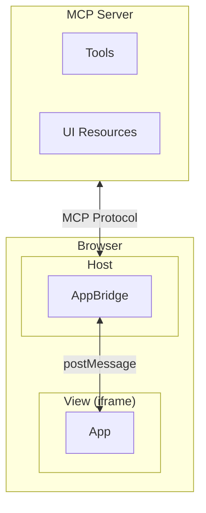

### How It Flows

When an LLM decides to call an app:

- **UI preloading** – The tool description exposes resource URI, allowing the host to preload the `ui://resource` and stream inputs before invocation.
- **Resource fetch** – The host retrieves the HTML UI bundle (with JS/CSS) from the server, with external assets restricted to origins declared in CSP rules.
- **Sandboxed rendering** – The UI runs in a sandboxed iframe isolating it from the parent page.
- **Bidirectional communication** – The app and host communicate via a JSON-RPC MCP dialect, supporting methods for tool calls, messaging, and context updates.

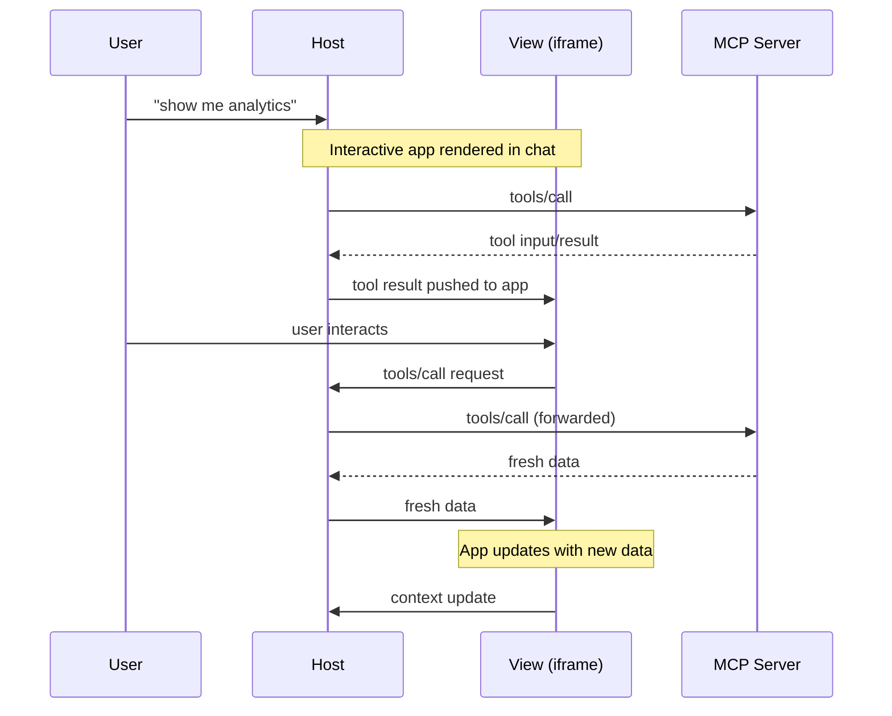

---

## 3. Detailed Lifecycle Flow

```
User prompt
    ↓
LLM decides to call tool (e.g. "display_pdf")
    ↓
Host sends tools/call to MCP Server
    ↓
Host also fetches ui:// resource (HTML) from MCP Server via resources/read
    ↓
Host renders HTML in sandboxed iframe
    ↓
iframe (View) sends ui/initialize to Host
    ↓
Host responds with McpUiInitializeResult (theme, dimensions, capabilities)
    ↓
View sends ui/notifications/initialized
    ↓
Host sends ui/notifications/tool-input (the tool arguments)
    ↓
Tool executes on server, Host gets result
    ↓
Host sends ui/notifications/tool-result to View
    ↓
View renders the data
    ↓
[Interactive phase: user clicks → View calls tools → updates UI]
```

### Sequence in Plain Language

1. **Discovery**: On connection, the host gets `tools/list` and sees tools with `_meta.ui.resourceUri`.
2. **Tool call**: LLM calls the tool. The host fetches the linked `ui://` resource HTML.
3. **Iframe boot**: Host loads HTML in a sandboxed iframe. The View initializes via `ui/initialize`.
4. **Data delivery**: Host pushes tool arguments (`tool-input`) and results (`tool-result`) to the View as JSON-RPC notifications over `postMessage`.
5. **Interactivity**: The View can call server tools back, update model context, send messages, etc.
6. **Teardown**: Host sends `ui/resource-teardown` before removing the iframe.

---

## 4. The Three Actors

| Actor | Role | Communicates via |
|-------|------|-----------------|
| **MCP Server** (your Python FastMCP code) | Registers tools + resources, executes tool logic, returns data | MCP protocol (JSON-RPC over stdio/HTTP) |
| **Host** (Claude, ChatGPT, Goose, etc.) | Orchestrates everything: calls tools, fetches resources, renders iframe, proxies messages | MCP to server; `postMessage` to View |
| **View** (your HTML/Svelte in the iframe) | Renders UI, handles user interaction, calls tools back | `postMessage` to Host (via MCP Apps JS SDK) |

**Key insight**: The View and the MCP Server never talk directly. The Host proxies everything.

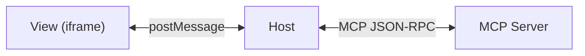

---

## 5. FastMCP Server-Side Setup (Python)

### Minimal Example

```python
import json
from fastmcp import FastMCP
from fastmcp.server.apps import AppConfig, ResourceCSP

mcp = FastMCP("My App Server")

RESOURCE_URI = "ui://my-app/view.html"

# 1. The tool — does work, returns data
@mcp.tool(app=AppConfig(resource_uri=RESOURCE_URI))
def get_data(query: str) -> str:
    result = {"items": [...], "count": 42}
    return json.dumps(result)

# 2. The resource — provides the HTML
@mcp.resource(RESOURCE_URI)
def app_view() -> str:
    return "<html>...</html>"
```

### AppConfig Fields

| Field | Type | Used On | Description |
|-------|------|---------|-------------|
| `resource_uri` | `str` | Tools only | URI of the `ui://` resource to render |
| `visibility` | `list[str]` | Tools only | `["model"]`, `["app"]`, or `["model", "app"]` |
| `csp` | `ResourceCSP` | Resources (or tools) | Content Security Policy for the iframe |
| `permissions` | `ResourcePermissions` | Resources | Iframe sandbox permissions (camera, clipboard, etc.) |
| `domain` | `str` | Resources | Stable sandbox origin |
| `prefers_border` | `bool` | Resources | Whether the UI wants a visible border |

### Wire Format Alternative

You can pass a raw dict with camelCase keys:

```python
@mcp.tool(app={"resourceUri": "ui://my-app/view.html"})
def my_tool() -> str:
    return "result"
```

---

## 6. Data Flow: content vs structuredContent vs _meta

This is one of the most important design decisions. The tool result has three channels:

| Field | Visible to LLM? | Visible to View? | Purpose |
|-------|-----------------|-------------------|---------|
| `content` | ✅ Yes | ✅ Yes | Text for model context. Keep it concise. |
| `structuredContent` | ❌ No* | ✅ Yes | Rich/structured data for UI rendering. |
| `_meta` | ❌ No | ✅ Yes | Metadata (timestamps, IDs, version info). |

> *⚠️ ChatGPT Apps SDK exposes `structuredContent` to both model and View. If you target both platforms, be aware of this difference.

### Why This Matters

- The LLM has a **context window limit**. Don't dump a 500KB JSON blob into `content`.
- The View needs **structured data** to render properly (objects, arrays, URLs). Put that in `structuredContent`.
- Use `content` to give the LLM a **summary** it can reason about.

### FastMCP Example with ToolResult

```python
from mcp import types
from fastmcp.tools import ToolResult

@mcp.tool(app=AppConfig(resource_uri=RESOURCE_URI))
def display_chart(data: list[float]) -> ToolResult:
    return ToolResult(
        content=[
            types.TextContent(type="text", text=f"Chart with {len(data)} data points, range {min(data)}-{max(data)}")
        ],
        # View gets the full data to render the chart
        # structuredContent is NOT in the model context
    )
```

For `structuredContent`, you need to return a dict with both keys at the top level. With the MCP SDK's `CallToolResult`:

```python
return {
    "content": [{"type": "text", "text": "Summary for the model"}],
    "structuredContent": {"full_data": [...], "config": {...}},
    "_meta": {"viewUUID": "abc-123"}
}
```

---

## 7. Tool Visibility

Controls **who** can call a tool:

| Visibility | LLM sees it? | View can call it? | Use case |
|-----------|-------------|-------------------|----------|
| `["model", "app"]` (default) | ✅ | ✅ | General-purpose tools |
| `["model"]` | ✅ | ❌ | Tools the LLM triggers but the UI shouldn't |
| `["app"]` | ❌ | ✅ | UI-only actions (refresh, delete, paginate) |

### When to Use App-Only Tools

Use `visibility: ["app"]` for:

- **Dangerous actions**: Delete, purchase, modify. Require explicit user click.
- **Pagination / chunking**: Loading more data, streaming bytes (like the PDF example).
- **UI refresh**: Fetching updated data without the LLM being involved.
- **Form submissions**: The user fills a form in the UI, not the LLM.

```python
@mcp.tool(app=AppConfig(
    resource_uri=RESOURCE_URI,
    visibility=["app"],
))
def delete_item(item_id: str) -> str:
    """Only callable from the app UI, not by the LLM."""
    do_delete(item_id)
    return "Deleted"
```

---

## 8. View-Side (Svelte) Architecture

### Entry Point

Your Svelte app communicates with the host via the `@modelcontextprotocol/ext-apps` SDK.

```typescript
// src/mcp-app.ts
import { mount } from "svelte";
import App from "./App.svelte";
import "./global.css";

mount(App, { target: document.getElementById("app")! });
```

### App.svelte — Core Pattern

```svelte
<script lang="ts">
import { onMount } from "svelte";
import {
  App,
  applyDocumentTheme,
  applyHostFonts,
  applyHostStyleVariables,
  type McpUiHostContext,
} from "@modelcontextprotocol/ext-apps";
import type { CallToolResult } from "@modelcontextprotocol/sdk/types.js";

let app = $state<App | null>(null);
let hostContext = $state<McpUiHostContext | undefined>();
let data = $state<MyDataType | null>(null);
let loading = $state(true);
let error = $state<string | null>(null);

// React to host theme changes
$effect(() => {
  if (hostContext?.theme) applyDocumentTheme(hostContext.theme);
  if (hostContext?.styles?.variables) applyHostStyleVariables(hostContext.styles.variables);
  if (hostContext?.styles?.css?.fonts) applyHostFonts(hostContext.styles.css.fonts);
});

onMount(async () => {
  const instance = new App({ name: "My App", version: "1.0.0" });

  // Called when tool arguments arrive (before result)
  instance.ontoolinput = (params) => {
    console.log("Tool arguments:", params.arguments);
    // Can show partial loading state based on what was requested
  };

  // Called when tool execution completes
  instance.ontoolresult = (result: CallToolResult) => {
    loading = false;
    if (result.isError) {
      error = result.content?.map(c => "text" in c ? c.text : "").join(" ") ?? "Unknown error";
    } else {
      data = result.structuredContent as MyDataType;
    }
  };

  instance.ontoolcancelled = (params) => {
    loading = false;
    error = `Cancelled: ${params.reason}`;
  };

  instance.onerror = (err) => {
    error = err.message;
  };

  instance.onhostcontextchanged = (ctx) => {
    hostContext = { ...hostContext, ...ctx };
  };

  await instance.connect();
  app = instance;
  hostContext = instance.getHostContext();
});
</script>

{#if loading}
  <LoadingState />
{:else if error}
  <ErrorState message={error} />
{:else if data}
  <MainView {data} {app} />
{/if}
```

### Key SDK Methods

| Method | Direction | Purpose |
|--------|-----------|---------|
| `app.callServerTool({name, arguments})` | View → Host → Server | Call any visible tool |
| `app.sendMessage({role, content})` | View → Host | Inject a message into the chat (triggers LLM response) |
| `app.updateModelContext({content})` | View → Host | Silently update what the LLM knows (no response triggered) |
| `app.sendLog({level, data})` | View → Host | Debug logging |
| `app.openLink({url})` | View → Host | Open URL in user's browser |
| `app.requestDisplayMode({mode})` | View → Host | Switch between inline/fullscreen/pip |
| `app.sendSizeChanged({height, width})` | View → Host | Tell host to resize the iframe |
| `app.getHostContext()` | — | Get current theme, dimensions, locale, etc. |
| `app.getHostCapabilities()` | — | Check what the host supports |

---

## 9. Keeping the Model in the Loop

The LLM **cannot see** user interactions inside the iframe. You must explicitly sync state.

### sendMessage() — Active Trigger

Sends a message as if the user typed it. The LLM will respond.

```typescript
// User clicks "Buy" in the UI
await app.sendMessage({
  role: "user",
  content: [{ type: "text", text: "I just purchased Nike Air Max for $129" }],
});
// → LLM responds: "Great choice! Want me to track your order?"
```

### updateModelContext() — Silent Background Update

Quietly saves context. No LLM response triggered. Overwrites previous context.

```typescript
// User is browsing — update silently
await app.updateModelContext({
  content: [{ type: "text", text: "User is viewing page 5 of the report" }],
});
// → No response. But if user asks "what page am I on?", the model knows.
```

### When to Use Which

| Scenario | Method |
|----------|--------|
| User completes a purchase | `sendMessage()` |
| User navigates to a new page | `updateModelContext()` |
| User submits a form | `sendMessage()` |
| User hovers over an item | `updateModelContext()` (or nothing) |
| User selects text | `updateModelContext()` |

---

## 10. Host Context & Theming

The host provides environment information via `hostContext`:

```typescript
interface HostContext {
  theme?: "light" | "dark";
  styles?: {
    variables?: Record<string, string>;  // CSS custom properties
    css?: { fonts?: string };            // @font-face rules
  };
  displayMode?: "inline" | "fullscreen" | "pip";
  availableDisplayModes?: string[];
  containerDimensions?: { width?: number; height?: number; maxWidth?: number; maxHeight?: number };
  locale?: string;        // "en-US"
  timeZone?: string;      // "America/New_York"
  platform?: "web" | "desktop" | "mobile";
  safeAreaInsets?: { top: number; right: number; bottom: number; left: number };
}
```

### Adapting to Theme

```css
:root {
  color-scheme: light dark;
  /* Fallbacks — used if host doesn't provide variables */
  --color-background-primary: light-dark(#ffffff, #1a1a1a);
  --color-text-primary: light-dark(#1f2937, #f3f4f6);
}
```

Always provide CSS fallback values. The host may not send all (or any) style variables.

### Container Dimensions

| Field | Meaning |
|-------|---------|
| `height` (fixed) | Host controls height. Fill it. |
| `maxHeight` (flexible) | View controls height up to this max. |
| `width` (fixed) | Host controls width. Fill it. |
| `maxWidth` (flexible) | View controls width up to this max. |
| *omitted* | View controls that dimension with no limit. |

When using flexible dimensions, send `ui/notifications/size-changed` (the SDK's `autoResize` handles this, or call `app.sendSizeChanged()` manually).

---

## 11. Security: CSP, Sandboxing & Safe Data Handling

MCP Apps run untrusted HTML inside a host application. Security is multi-layered: iframe sandboxing isolates the View, Content Security Policy restricts what it can load, and server-side validation protects against malicious input. Understanding all three layers is essential.

### 11.1 The Sandbox Model

The View runs inside a sandboxed iframe. The Host sets restrictive iframe sandbox attributes that **deny by default**:

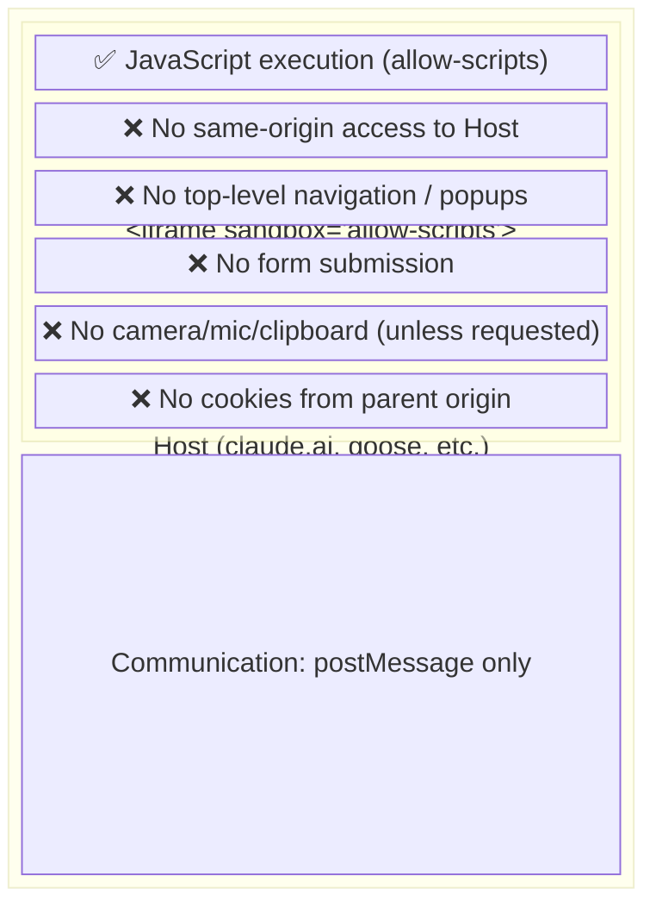

**What sandbox isolation means in practice:**

- The View **cannot** read the Host's DOM, cookies, localStorage, or sessionStorage.
- The View **cannot** navigate the Host window (`window.top`, `window.parent.location`).
- The View **cannot** open popups or new windows.
- The View **cannot** submit forms (traditional HTTP form submission — use JS `fetch` or `callServerTool` instead).
- Each View instance gets a **unique opaque origin**, so different MCP App Views are isolated from each other too.

### 11.2 Content Security Policy (CSP) — Deny by Default

On top of the sandbox, the Host applies a Content Security Policy to the iframe. The default CSP blocks **all external network access**: no loading scripts, images, styles, fonts, or making `fetch` requests to any domain.

**Default CSP (simplified):**

```
default-src 'none';
script-src 'unsafe-inline';
style-src 'unsafe-inline';
```

This means:

| Action | Allowed by Default? | How to Enable |
|--------|---------------------|---------------|
| Inline `<script>` and `<style>` | ✅ Yes | — |
| `<script src="https://cdn.example.com">` | ❌ Blocked | `resource_domains` |
| `` | ❌ Blocked | `resource_domains` |
| `<link rel="stylesheet" href="https://...">` | ❌ Blocked | `resource_domains` |
| `fetch("https://api.example.com/data")` | ❌ Blocked | `connect_domains` |
| WebSocket to `wss://realtime.example.com` | ❌ Blocked | `connect_domains` |
| `<iframe src="https://youtube.com/embed/...">` | ❌ Blocked | `frame_domains` |
| `` | ✅ Yes | — (inline data) |

**The most common mistake:** You add a CDN image URL in `structuredContent`, render it as ``, and it silently doesn't load. No error in the console, no broken image icon — just nothing. Always check the CSP.

### 11.3 Declaring CSP Rules

Declare exactly which external domains your app needs. The Host uses these declarations to build the actual CSP header on the iframe.

```python
from fastmcp.server.apps import AppConfig, ResourceCSP

@mcp.resource(
    "ui://my-app/view.html",
    app=AppConfig(
        csp=ResourceCSP(
            # Scripts, images, styles, fonts loaded via <script>, , <link>, etc.
            resource_domains=[
                "https://unpkg.com",           # JS libraries
                "https://cdn.jsdelivr.net",    # JS libraries
                "https://fonts.googleapis.com", # Google Fonts CSS
                "https://fonts.gstatic.com",   # Google Fonts files
            ],
            # fetch(), XHR, WebSocket, EventSource
            connect_domains=[
                "https://api.example.com",     # Your backend API
            ],
            # Nested iframes
            frame_domains=[
                "https://www.youtube.com",     # Embedded videos
            ],
        )
    ),
)
def my_view() -> str:
    return "<html>...</html>"
```

#### CSP Field Reference

| CSP Field | Maps To | Controls | Example Use |
|-----------|---------|----------|-------------|
| `resource_domains` | `script-src`, `img-src`, `style-src`, `font-src`, `media-src` | Loading assets via HTML tags | CDN scripts, external images, web fonts |
| `connect_domains` | `connect-src` | `fetch()`, `XMLHttpRequest`, `WebSocket`, `EventSource` | REST APIs, real-time connections |
| `frame_domains` | `frame-src` | Nested `<iframe>` elements | YouTube embeds, maps |
| `base_uri_domains` | `base-uri` | `<base>` element | Rarely needed |

#### Key Rules

1. **Always use `https://`**. HTTP is blocked by most hosts.
2. **Be specific**. Don't use wildcards. List exact domains.
3. **Separate resource vs connect**. A CDN you load `<script>` from goes in `resource_domains`. An API you `fetch()` from goes in `connect_domains`. They're different CSP directives.
4. **Google Fonts needs TWO domains**: `fonts.googleapis.com` (CSS) and `fonts.gstatic.com` (font files), both in `resource_domains`.
5. **Data URIs are always allowed**. `` works without any CSP declaration.

### 11.4 Permissions (Browser Capabilities)

Some browser APIs require explicit permission. Declare what you need; the Host decides whether to grant it.

```python
from fastmcp.server.apps import AppConfig, ResourcePermissions

@mcp.resource(
    "ui://my-app/view.html",
    app=AppConfig(
        permissions=ResourcePermissions(
            camera={},             # getUserMedia video
            microphone={},         # getUserMedia audio
            clipboard_write={},    # navigator.clipboard.writeText()
            geolocation={},        # navigator.geolocation
        )
    ),
)
```

**Important:** Permissions may be **silently denied**. The Host can choose not to grant them, and your JS code will get a `NotAllowedError` or similar. Always wrap permission-dependent code in try/catch:

```typescript
async function copyToClipboard(text: string) {
  try {
    await navigator.clipboard.writeText(text);
    showToast("Copied!");
  } catch {
    // Fallback: select text for manual copy
    const textarea = document.createElement("textarea");
    textarea.value = text;
    document.body.appendChild(textarea);
    textarea.select();
    showToast("Press Ctrl+C to copy");
  }
}
```

### 11.5 Safe Handling of User-Provided URLs

When a user provides a URL (e.g., "display this PDF", "load this image"), the data flows through the Server, not the View. This is a critical security boundary.

#### Threat: Server-Side Request Forgery (SSRF)

If the user gives a URL and your server blindly `fetch()`es it, they can:

- Access internal services: `http://localhost:8080/admin`, `http://169.254.169.254/metadata` (cloud instance metadata)
- Scan internal networks: `http://10.0.0.1:22`
- Exfiltrate data from the server's network
- Trigger denial of service against internal endpoints

#### Defense: Origin Allowlisting

**NEVER blindly fetch user-provided URLs.** Always validate against a domain allowlist:

```python
ALLOWED_ORIGINS = {
    "https://arxiv.org",
    "https://www.biorxiv.org",
    "https://zenodo.org",
    # Add your trusted sources
}

def validate_url(url: str) -> tuple[bool, str | None]:
    """Validate a URL before the server fetches it."""
    # Block private/internal networks
    if url.startswith(("http://localhost", "http://127.", "http://10.",
                       "http://172.16.", "http://192.168.", "http://169.254.")):
        return False, "Internal network access blocked"

    # Block non-HTTPS (except file:// for local files)
    parsed = urllib.parse.urlparse(url)
    if parsed.scheme not in ("https", "file"):
        return False, f"Only HTTPS URLs allowed, got: {parsed.scheme}"

    # Check against allowlist
    origin = f"{parsed.scheme}://{parsed.hostname}"
    if not any(origin.startswith(allowed) for allowed in ALLOWED_ORIGINS):
        return False, f"Origin not allowed: {origin}"

    return True, None
```

#### Defense: Size Limits

Always limit how much data the server will download:

```python
MAX_DOWNLOAD_SIZE = 50 * 1024 * 1024  # 50 MB

async def safe_fetch(url: str) -> bytes:
    response = await httpx.get(url, follow_redirects=True, timeout=30)

    # Check Content-Length header first
    content_length = response.headers.get("content-length")
    if content_length and int(content_length) > MAX_DOWNLOAD_SIZE:
        raise ValueError(f"File too large: {content_length} bytes")

    data = response.content
    if len(data) > MAX_DOWNLOAD_SIZE:
        raise ValueError(f"File too large: {len(data)} bytes")

    return data
```

#### Defense: Content-Type Validation

If you expect a PDF, verify it is a PDF:

```python
def validate_pdf(data: bytes):
    if not data.startswith(b"%PDF"):
        raise ValueError("Not a valid PDF file")
```

#### Complete Safe URL Flow

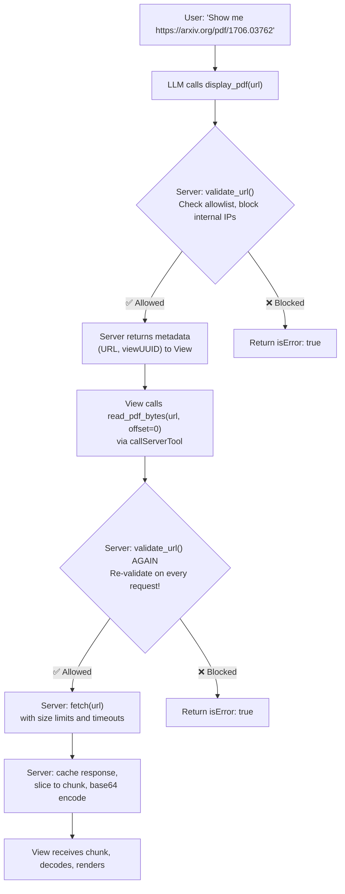

**Critical: Validate on EVERY tool call, not just the first.** A compromised View could call `read_pdf_bytes(url="http://169.254.169.254/latest/meta-data/")`.

### 11.6 Safe Handling of User-Uploaded Files

If your app allows users to "upload" files (drag-drop, file picker), the flow is different from URLs because the file bytes originate in the browser, not from a remote server.

#### Architecture: File Upload Flow

```mermaid
sequenceDiagram
    participant View as View (iframe)
    participant Host
    participant Server as MCP Server

    View->>View: User selects file via <input type="file">
    View->>View: FileReader → base64 encode
    View->>Host: callServerTool("process_image", {data: base64})
    Host->>Server: tools/call (forwarded)
    Server->>Server: Validate size, MIME type, magic bytes, sanitize filename
    Server-->>Host: result { structuredContent: processed data }
    Host-->>View: tool result
    View->>View: Render processed result
```

The View reads the file with `FileReader`, base64-encodes it, and sends it to the server via `callServerTool()`:

```typescript
// View: File input handler
async function handleFileUpload(event: Event) {
  const input = event.target as HTMLInputElement;
  const file = input.files?.[0];
  if (!file) return;

  // Client-side validation first (fast, UX-friendly)
  if (file.size > 10 * 1024 * 1024) {
    showError("File too large (max 10 MB)");
    return;
  }

  if (!file.type.startsWith("image/")) {
    showError("Only image files are accepted");
    return;
  }

  // Read as base64
  const base64 = await new Promise<string>((resolve, reject) => {
    const reader = new FileReader();
    reader.onload = () => {
      const dataUrl = reader.result as string;
      resolve(dataUrl.split(",")[1]); // Strip "data:...;base64," prefix
    };
    reader.onerror = reject;
    reader.readAsDataURL(file);
  });

  // Send to server via tool call
  loading = true;
  const result = await app.callServerTool({
    name: "process_image",
    arguments: {
      filename: file.name,
      mimeType: file.type,
      data: base64,
      size: file.size,
    },
  });

  processedResult = result.structuredContent;
  loading = false;
}
```

```python
# Server: Validate EVERYTHING again (never trust client-side validation)
import base64, imghdr

MAX_UPLOAD_SIZE = 10 * 1024 * 1024  # 10 MB
ALLOWED_MIME_TYPES = {"image/png", "image/jpeg", "image/webp", "image/gif"}

@mcp.tool(app=AppConfig(resource_uri=RESOURCE_URI, visibility=["app"]))
def process_image(filename: str, mime_type: str, data: str, size: int) -> dict:
    # 1. Validate size
    if size > MAX_UPLOAD_SIZE:
        return {"content": [{"type": "text", "text": "File too large"}], "isError": True}

    # 2. Validate MIME type
    if mime_type not in ALLOWED_MIME_TYPES:
        return {"content": [{"type": "text", "text": f"Type not allowed: {mime_type}"}], "isError": True}

    # 3. Decode and verify actual content
    try:
        raw_bytes = base64.b64decode(data)
    except Exception:
        return {"content": [{"type": "text", "text": "Invalid base64 data"}], "isError": True}

    # 4. Check actual size (client could lie)
    if len(raw_bytes) > MAX_UPLOAD_SIZE:
        return {"content": [{"type": "text", "text": "Decoded data too large"}], "isError": True}

    # 5. Verify magic bytes match claimed MIME type
    detected_type = imghdr.what(None, h=raw_bytes)
    if detected_type not in ("png", "jpeg", "gif", "webp"):
        return {"content": [{"type": "text", "text": "File is not a valid image"}], "isError": True}

    # 6. Sanitize filename (prevent path traversal)
    safe_filename = os.path.basename(filename)
    safe_filename = re.sub(r'[^\w.\-]', '_', safe_filename)

    # Now safe to process
    result = do_image_processing(raw_bytes)
    return {
        "content": [{"type": "text", "text": f"Processed {safe_filename}"}],
        "structuredContent": result,
    }
```

#### Upload Security Checklist

| Check | Where | Why |
|-------|-------|-----|
| File size limit | View AND Server | UX (fast reject) + actual enforcement |
| MIME type allowlist | View AND Server | Client check can be bypassed |
| Decode base64 in try/catch | Server | Malformed data crashes the handler |
| Verify actual content type (magic bytes) | Server | Attacker can set any MIME type |
| Sanitize filename | Server | Prevent `../../etc/passwd` path traversal |
| Re-check decoded size | Server | Base64 string size ≠ decoded size; client can lie about `size` |

#### Chunked Upload for Large Files

For files >1MB, consider chunked uploads to avoid hitting tool response size limits:

```typescript
// View: Upload in chunks
async function uploadLargeFile(file: File) {
  const CHUNK_SIZE = 512 * 1024; // 512KB
  const totalChunks = Math.ceil(file.size / CHUNK_SIZE);

  // Start upload session
  const session = await app.callServerTool({
    name: "start_upload",
    arguments: { filename: file.name, totalSize: file.size, mimeType: file.type },
  });
  const uploadId = session.structuredContent.uploadId;

  // Send chunks
  for (let i = 0; i < totalChunks; i++) {
    const start = i * CHUNK_SIZE;
    const end = Math.min(start + CHUNK_SIZE, file.size);
    const slice = file.slice(start, end);

    const base64Chunk = await readAsBase64(slice);
    await app.callServerTool({
      name: "upload_chunk",
      arguments: { uploadId, chunkIndex: i, data: base64Chunk },
    });
    updateProgress(end, file.size);
  }

  // Finalize
  const result = await app.callServerTool({
    name: "finalize_upload",
    arguments: { uploadId },
  });
}
```

### 11.7 CSP Debugging

When things don't load and you can't figure out why, it's almost always CSP.

#### Symptoms of CSP Violations

| Symptom | Likely Cause |
|---------|-------------|
| Image doesn't render (no error, just blank) | Domain missing from `resource_domains` |
| `fetch()` throws `TypeError: Failed to fetch` | Domain missing from `connect_domains` |
| External script doesn't execute (no error) | Domain missing from `resource_domains` |
| Embedded iframe shows blank | Domain missing from `frame_domains` |
| WebSocket connection refused | Domain missing from `connect_domains` |
| Font doesn't load (fallback font shown) | Font CDN domain missing from `resource_domains` |

#### How to Debug

1. **Open browser DevTools → Console**. CSP violations show as `Refused to load...` errors.
2. **Check the Network tab**. Blocked requests may show as `(blocked:csp)`.
3. **Verify your AppConfig declaration matches what the Host sets.** Some hosts may not apply your CSP exactly as declared.
4. **Test incrementally.** Start with everything inline (no external deps), then add one external domain at a time.

#### Common CSP Mistakes

```python
# ❌ WRONG: Forgot to include the image CDN
@mcp.resource("ui://app/view.html",
    app=AppConfig(csp=ResourceCSP(
        connect_domains=["https://api.example.com"],  # Only connect
        # Images from cdn.example.com will silently fail!
    ))
)

# ✅ RIGHT: Both API and image CDN declared
@mcp.resource("ui://app/view.html",
    app=AppConfig(csp=ResourceCSP(
        connect_domains=["https://api.example.com"],
        resource_domains=["https://cdn.example.com"],
    ))
)

# ❌ WRONG: Put the API in resource_domains instead of connect_domains
@mcp.resource("ui://app/view.html",
    app=AppConfig(csp=ResourceCSP(
        resource_domains=["https://api.example.com"],  # This allows <script src=...>
        # But fetch("https://api.example.com") is STILL blocked!
    ))
)

# ✅ RIGHT: API goes in connect_domains
@mcp.resource("ui://app/view.html",
    app=AppConfig(csp=ResourceCSP(
        connect_domains=["https://api.example.com"],
    ))
)
```

### 11.8 Security Architecture Summary

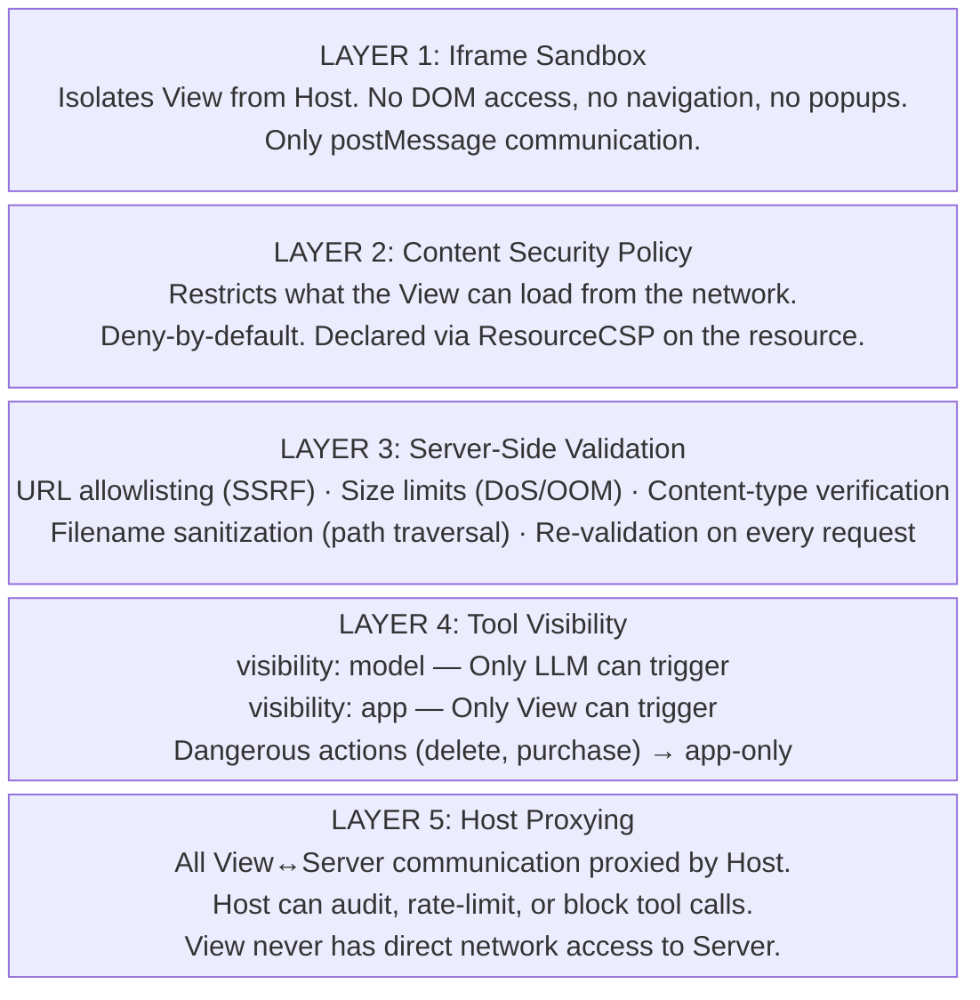

#### Security Decision Checklist

| Question | Action |
|----------|--------|
| App loads external JS/CSS/images? | Declare domains in `resource_domains` |
| App calls external APIs via fetch? | Declare domains in `connect_domains` |
| App embeds external iframes? | Declare domains in `frame_domains` |
| App needs camera/mic/clipboard? | Declare in `permissions`, handle denial gracefully |
| User provides URLs? | Validate against origin allowlist, block private IPs |
| User uploads files? | Validate size, MIME type, magic bytes, sanitize filename |
| Server fetches external resources? | Allowlist origins, set size limits, set timeouts |
| Tool handles dangerous actions? | Make it `visibility: ["app"]` — require explicit click |
| Data contains filenames/paths? | Sanitize: strip `..`, use `basename`, reject special chars |

---

## 12. Build System: Single-File HTML

MCP resources are served as single HTML strings. The standard pattern is to use **Vite + vite-plugin-singlefile** to bundle your Svelte app into one HTML file.

### vite.config.ts

```typescript
import { defineConfig } from "vite";
import { svelte } from "@sveltejs/vite-plugin-svelte";
import { viteSingleFile } from "vite-plugin-singlefile";

export default defineConfig({
  plugins: [svelte(), viteSingleFile()],
  build: {
    rollupOptions: { input: "mcp-app.html" },
    outDir: "dist",
    emptyOutDir: false,
  },
});
```

### Why Single-File?

The `ui://` resource returns HTML as a string (or base64 blob). There's no web server serving your assets. Everything — CSS, JS, images (as data URIs) — must be inlined into one HTML file.

**Alternative**: If you need external resources, declare them in `csp.resource_domains` and load via CDN.

### Server Reads the Built HTML

```python
import fs from "node:fs/promises";

@mcp.resource(RESOURCE_URI)
async def app_view() -> str:
    return await fs.readFile("dist/mcp-app.html", "utf-8")
```

---

## 13. Loading, Error, and Streaming States

The iframe typically renders **before** the tool finishes executing. You must handle:

### 1. Loading State

The View boots → shows loading UI → waits for `ontoolresult`.

```svelte
{#if loading}
  <div class="loading">
    <div class="spinner"></div>
    <p>Loading...</p>
  </div>
{/if}
```

### 2. Partial Loading via ontoolinput

`ontoolinput` fires with the tool arguments **before** the tool result arrives. You can show what's being fetched:

```typescript
instance.ontoolinput = (params) => {
  // params.arguments = { query: "Stockholm weather" }
  loadingMessage = `Fetching weather for ${params.arguments.query}...`;
};
```

There's also `ontoolinputpartial` for streamed arguments during LLM generation.

### 3. Error State

Always check `result.isError`:

```typescript
instance.ontoolresult = (result) => {
  if (result.isError) {
    error = result.content?.map(c => c.text).join(" ");
  } else {
    data = result.structuredContent;
  }
};
```

### 4. Chunked Loading (Large Data)

For large payloads (PDFs, datasets), use app-only tools to stream in chunks:

```typescript
// View-side: load in chunks
let offset = 0;
let hasMore = true;

while (hasMore) {
  const result = await app.callServerTool({
    name: "read_chunk",
    arguments: { url, offset, byteCount: 512 * 1024 },
  });
  const chunk = result.structuredContent;
  chunks.push(chunk.data);
  offset += chunk.byteCount;
  hasMore = chunk.hasMore;
  updateProgress(offset, chunk.totalBytes);
}
```

Server-side: register the chunking tool as `visibility: ["app"]`.

---

## 14. Data Transfer Patterns — How Data Moves Between Server and View

This is one of the most important sections to understand. In MCP Apps, the **View (iframe) and Server never communicate directly**. Every byte goes through the Host as a proxy, and the only transport is JSON-RPC over `postMessage`. This creates specific constraints and patterns.

### 14.1 The Fundamental Constraint

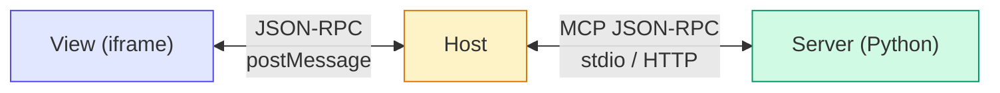

**What this means in practice:**

- There are **no WebSockets** between the View and Server.
- There is **no HTTP** between the View and Server.
- There is **no streaming** in the traditional sense — only request/response tool calls.
- All data must be **serializable as JSON** (binary data → base64).
- Tool call responses may have **size limits** imposed by the Host.
- The View can only get data by: (a) receiving tool results pushed by the Host, or (b) calling `app.callServerTool()`.

### 14.2 Pattern: One-Shot Data Delivery

The simplest pattern. The LLM calls a tool, the server returns data, the Host pushes it to the View.

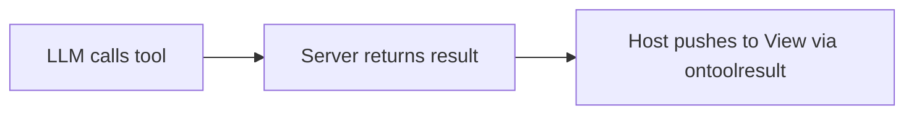

**When to use:** Small payloads (<100KB), data that doesn't change, initial render data.

#### Server (FastMCP)

```python
@mcp.tool(app=AppConfig(resource_uri=RESOURCE_URI))
def show_cocktail(cocktail_id: str) -> dict:
    cocktail = db.get_cocktail(cocktail_id)
    return {
        "content": [{"type": "text", "text": f'Loaded "{cocktail.name}"'}],
        "structuredContent": {
            "name": cocktail.name,
            "ingredients": cocktail.ingredients,
            "instructions": cocktail.instructions,
            "imageUrl": cocktail.image_url,  # URL, not the image bytes!
        },
    }
```

#### View (Svelte)

```svelte
<script lang="ts">
  // ontoolresult fires ONCE with the initial tool result
  instance.ontoolresult = (result) => {
    data = result.structuredContent;
  };
</script>

{#if data}
  <h1>{data.name}</h1>
  <!-- The image is loaded by the BROWSER directly from the URL -->
  <!-- This requires the URL's domain to be in csp.resource_domains! -->
  
{/if}
```

**Key insight about images:** The server sends a *URL* in structuredContent. The **browser** (iframe) downloads the image directly from that URL. The image bytes never flow through the MCP protocol. But the URL's domain must be declared in `csp.resource_domains` on the resource, or the CSP will block it.

#### Flow diagram:

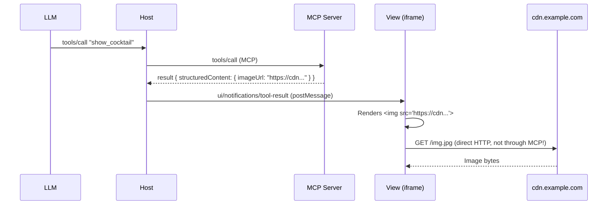

### 14.3 Pattern: Chunked Binary Transfer (PDF Example)

When data is too large for a single tool response (some hosts limit to ~512KB–1MB per response), stream it in chunks. This is the pattern used by the PDF viewer example.

**When to use:** Large files (PDFs, images, datasets), binary data, anything >100KB.

#### Architecture

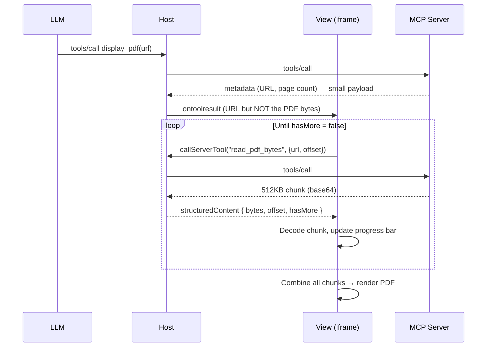

The trick: `display_pdf` is model-visible (LLM can call it). `read_pdf_bytes` is `visibility: ["app"]` — only the View calls it, in a loop.

#### Server — Two Tools Working Together

```python
RESOURCE_URI = "ui://pdf-viewer/view.html"

# Tool 1: LLM-facing. Returns metadata only (small).
@mcp.tool(app=AppConfig(resource_uri=RESOURCE_URI))
def display_pdf(url: str, page: int = 1) -> dict:
    return {
        "content": [{"type": "text", "text": f"Displaying PDF: {url}"}],
        "structuredContent": {"url": url, "initialPage": page},
        "_meta": {"viewUUID": str(uuid4())},
    }

# Tool 2: App-only. Called repeatedly by the View to stream chunks.
@mcp.tool(app=AppConfig(resource_uri=RESOURCE_URI, visibility=["app"]))
def read_pdf_bytes(url: str, offset: int = 0, byte_count: int = 512_000) -> dict:
    # Server downloads the PDF (or reads from cache/disk)
    data, total_bytes = read_range(url, offset, byte_count)

    return {
        "content": [{"type": "text", "text": f"{len(data)} bytes at {offset}/{total_bytes}"}],
        "structuredContent": {
            "bytes": base64.b64encode(data).decode(),  # Binary → base64 string
            "offset": offset,
            "byteCount": len(data),
            "totalBytes": total_bytes,
            "hasMore": offset + len(data) < total_bytes,
        },
    }
```

#### View — Chunked Download Loop

```typescript
async function loadInChunks(url: string): Promise<Uint8Array> {
  const chunks: Uint8Array[] = [];
  let offset = 0;
  let hasMore = true;

  while (hasMore) {
    // Each call goes: View → Host → Server → Host → View
    const result = await app.callServerTool({
      name: "read_pdf_bytes",
      arguments: { url, offset, byteCount: 512_000 },
    });

    const chunk = result.structuredContent as ChunkResponse;

    // Decode base64 → binary
    const binary = atob(chunk.bytes);
    const bytes = new Uint8Array(binary.length);
    for (let i = 0; i < binary.length; i++) {
      bytes[i] = binary.charCodeAt(i);
    }
    chunks.push(bytes);

    offset += chunk.byteCount;
    hasMore = chunk.hasMore;
    updateProgress(offset, chunk.totalBytes);  // Show progress bar
  }

  // Combine all chunks into one Uint8Array
  const full = new Uint8Array(offset);
  let pos = 0;
  for (const chunk of chunks) {
    full.set(chunk, pos);
    pos += chunk.length;
  }
  return full;
}

// Called from ontoolresult:
app.ontoolresult = async (result) => {
  const { url } = result.structuredContent;
  showLoading("Loading PDF...");
  const pdfBytes = await loadInChunks(url);
  // Now render with PDF.js
  const doc = await pdfjsLib.getDocument({ data: pdfBytes }).promise;
  renderPage(doc, 1);
};
```

#### Why the Server Downloads the PDF, Not the View

You might wonder: why doesn't the View just `fetch()` the PDF directly?

1. **CSP restrictions**: The iframe's CSP blocks network requests unless the domain is declared in `connect_domains`. You'd need to allowlist every possible PDF source.
2. **CORS**: Many PDF servers don't set CORS headers, so browser `fetch()` from an iframe would fail.
3. **Server-side validation**: The server can validate URLs against an allowlist before fetching.
4. **Caching**: The server can cache downloaded files across requests within a session (the PDF example does this with a session-local cache that auto-expires).
5. **Authentication**: The server can add auth headers that shouldn't be exposed to the client.

**Rule of thumb:** For external data, the Server acts as a proxy. The View asks the Server for data via `callServerTool()`. The Server fetches, processes, and returns it as JSON (binary as base64).

### 14.4 Pattern: Polling for Live Data (System Monitor Example)

MCP Apps have **no push mechanism from server to View**. The server cannot spontaneously send data to the View. So for "live" dashboards, the View must **poll** — repeatedly calling a tool on a timer.

**When to use:** Real-time dashboards, monitoring, live status, anything that updates over time.

#### Architecture

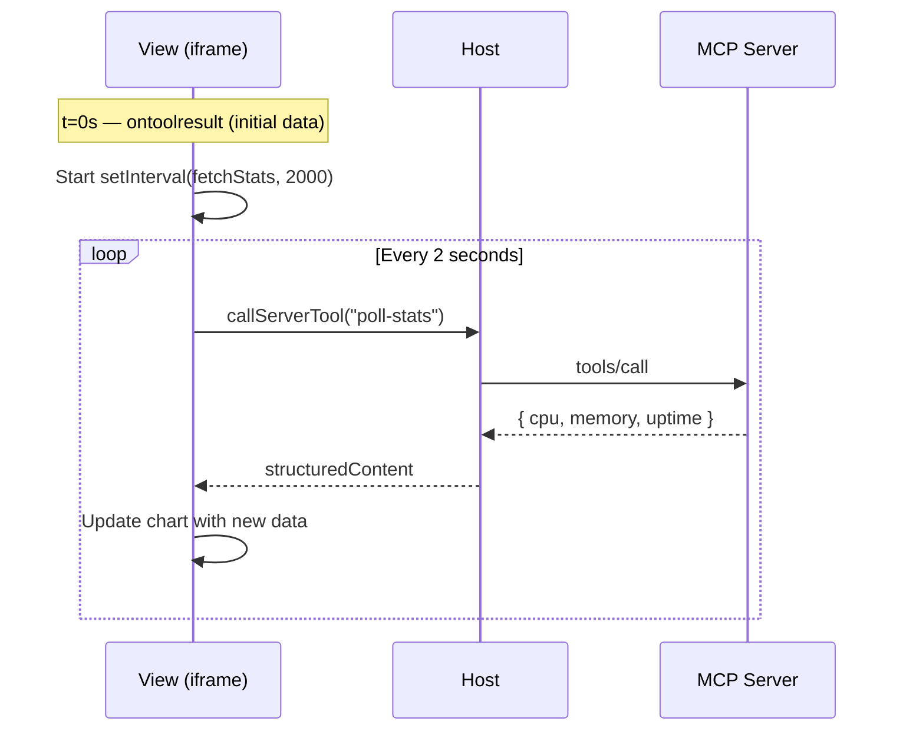

#### Server — Static Info Tool + Polling Tool

```python
RESOURCE_URI = "ui://monitor/view.html"

# Tool 1: LLM-facing. Returns static system config. Called ONCE.
@mcp.tool(app=AppConfig(resource_uri=RESOURCE_URI))
def get_system_info() -> dict:
    import platform, os
    info = {
        "hostname": platform.node(),
        "platform": f"{platform.system()} {platform.machine()}",
        "cpuCount": os.cpu_count(),
        "totalMemory": os.sysconf('SC_PAGE_SIZE') * os.sysconf('SC_PHYS_PAGES'),
    }
    return {
        "content": [{"type": "text", "text": f"System: {info['hostname']}"}],
        "structuredContent": info,
    }

# Tool 2: App-only. Called every 2 seconds by the View.
# IMPORTANT: Returns raw CPU timing counters, NOT percentages.
# The View calculates usage from deltas between polls (more accurate).
@mcp.tool(app=AppConfig(resource_uri=RESOURCE_URI, visibility=["app"]))
def poll_system_stats() -> dict:
    import os, psutil
    # Raw timing counters per core — client computes deltas
    cpu_cores = []
    for cpu in os.cpu_info():  # or psutil.cpu_times(percpu=True)
        times = cpu.times
        idle = times.idle
        total = times.user + times.nice + times.sys + times.idle + times.irq
        cpu_cores.append({"idle": idle, "total": total})

    mem = psutil.virtual_memory()
    stats = {
        "cpu": {"cores": cpu_cores},
        "memory": {
            "usedBytes": mem.used,
            "usedPercent": round(mem.used / mem.total * 100),
            "freeBytes": mem.available,
        },
        "uptime": {"seconds": os.uptime()},
        "timestamp": datetime.now().isoformat(),
    }
    return {
        "content": [{"type": "text", "text": "Stats polled"}],
        "structuredContent": stats,
    }
```

> **Why raw counters instead of percentages?** The server returns cumulative `idle` and `total` tick counters. The View stores the previous snapshot and calculates `usage = 1 - (idleDelta / totalDelta)`. This is more accurate than server-side `cpu_percent()` because it measures exactly the interval between the View's polls, not an arbitrary server-side window.

#### View — Poll Loop with Client-Side Delta Calculation

```svelte
<script lang="ts">
  let intervalId: number | null = null;
  let cpuHistory: number[][] = [];
  let previousCpuSnapshots: Array<{idle: number, total: number}> | null = null;
  const POLL_INTERVAL = 2000;
  const HISTORY_LENGTH = 30; // 1 minute at 2s intervals

  // Calculate CPU usage from raw timing deltas (not server percentages)
  function calculateCpuUsage(
    current: Array<{idle: number, total: number}>,
    previous: Array<{idle: number, total: number}> | null
  ): number[] {
    if (!previous || previous.length !== current.length) {
      return current.map(() => 0); // First poll: no delta yet
    }
    return current.map((cur, i) => {
      const prev = previous[i];
      const idleDiff = cur.idle - prev.idle;
      const totalDiff = cur.total - prev.total;
      if (totalDiff === 0) return 0;
      return Math.round((1 - idleDiff / totalDiff) * 100);
    });
  }

  async function fetchStats() {
    try {
      const result = await app.callServerTool({
        name: "poll-system-stats",
        arguments: {},
      });
      const stats = result.structuredContent as PollStats;

      // Calculate CPU percentages from raw counter deltas
      const coreUsages = calculateCpuUsage(stats.cpu.cores, previousCpuSnapshots);
      previousCpuSnapshots = stats.cpu.cores; // Store for next delta

      // Append to rolling history
      cpuHistory = [...cpuHistory.slice(-(HISTORY_LENGTH - 1)), coreUsages];

      // Update memory bar, uptime, chart, etc.
      updateUI(stats);
    } catch (err) {
      console.error("Poll failed:", err);
      // Don't stop polling on transient errors
    }
  }

  function startPolling() {
    fetchStats(); // Immediate first fetch
    intervalId = window.setInterval(fetchStats, POLL_INTERVAL);
  }

  function stopPolling() {
    if (intervalId) {
      clearInterval(intervalId);
      intervalId = null;
    }
  }

  onMount(() => {
    // ... app setup ...
    instance.ontoolresult = (result) => {
      systemInfo = result.structuredContent;
      startPolling(); // Start polling after initial data
    };

    return () => stopPolling(); // Cleanup on unmount
  });
</script>
```

#### Polling Design Decisions

| Decision | Guidance |
|----------|----------|
| Poll interval | 1–5s for real-time feel. >10s for background status. |
| Error handling | Log and continue. Don't stop polling on transient errors. |
| History size | Keep a fixed-size sliding window (e.g., 30 points for 1 min at 2s). |
| Start/stop | Give user a toggle button. Auto-start is fine but let them stop. |
| Cleanup | Always `clearInterval` on unmount / teardown. |
| CPU calculations | Do delta calculations **client-side** from raw counters, not server-side percentages (more accurate between polls). |

### 14.5 Pattern: User-Triggered Data Fetch

The View calls a tool in response to a user action (button click, form submit, page navigation).

**When to use:** Pagination, search, form submission, refresh buttons, any user-driven action.

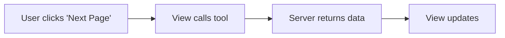

#### View

```typescript
async function handleNextPage() {
  currentPage++;
  loading = true;

  const result = await app.callServerTool({
    name: "get_page_data",
    arguments: { page: currentPage, query: currentQuery },
  });

  pageData = result.structuredContent;
  loading = false;

  // Keep the model informed about what the user is viewing
  app.updateModelContext({
    content: [{ type: "text", text: `User is viewing page ${currentPage} of search results for "${currentQuery}"` }],
  });
}
```

### 14.6 Pattern: Image/Media Handling

Images can be transferred in three ways, each with different trade-offs:

#### Option A: URL Reference (Recommended for External Images)

Server returns a URL. The browser loads the image directly.

```python
# Server
return {"structuredContent": {"imageUrl": "https://cdn.example.com/photo.jpg"}}
```

```svelte
<!-- View: Browser fetches directly -->

```

**Requires:** `csp.resource_domains` includes the image domain.
**Pros:** Fast, no base64 overhead, no size limits.
**Cons:** Needs CSP config, CORS must be permissive, URL must be publicly accessible.

#### Option B: Base64 Inline (For Server-Generated Images)

Server generates or processes an image and returns it as base64.

```python
# Server: Generate a QR code, chart, or process an image
import base64
buffer = generate_qr_code("https://example.com")
b64 = base64.b64encode(buffer).decode()

return {
    "content": [{"type": "image", "data": b64, "mimeType": "image/png"}],
    "structuredContent": {"imageData": b64, "mimeType": "image/png"},
}
```

```svelte
<!-- View: Render from base64 data URI -->

```

**Requires:** Nothing special (no CSP needed).
**Pros:** Works offline, no CORS issues, no external domains needed.
**Cons:** ~33% size overhead from base64, counts against tool response size limits. Keep images <500KB.

#### Option C: Chunked Binary (For Large Server-Side Files)

Same as the PDF pattern. Use when the file is too large for a single response.

```python
# Server: App-only chunking tool
@mcp.tool(app=AppConfig(visibility=["app"]))
def read_image_chunk(image_id: str, offset: int = 0) -> dict:
    data = read_bytes(image_id, offset, CHUNK_SIZE)
    return {
        "structuredContent": {
            "bytes": base64.b64encode(data).decode(),
            "offset": offset,
            "totalBytes": get_total_size(image_id),
            "hasMore": offset + len(data) < get_total_size(image_id),
        }
    }
```

#### Decision Guide for Media

| Scenario | Pattern | Why |
|----------|---------|-----|
| Image from a public CDN | URL reference | Fast, no overhead |
| Server-generated chart/QR | Base64 inline | No external dependency |
| User-uploaded file on server | Base64 inline (small) or chunked (large) | Not publicly accessible |
| Large PDF/document | Chunked binary | Too big for single response |
| Video | URL reference only | Far too large for base64 |

### 14.7 Pattern: Bidirectional Form Workflow

The View collects user input, sends it to the server for processing, and displays the result.

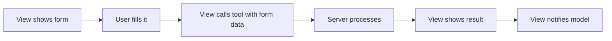

```python
# Server: App-only tool for form submission
@mcp.tool(app=AppConfig(resource_uri=RESOURCE_URI, visibility=["app"]))
def submit_order(items: list[dict], address: str) -> dict:
    order = create_order(items, address)
    return {
        "content": [{"type": "text", "text": f"Order {order.id} created"}],
        "structuredContent": {
            "orderId": order.id,
            "status": "confirmed",
            "estimatedDelivery": order.delivery_date.isoformat(),
        },
    }
```

```typescript
// View: After form submission
async function handleSubmit() {
  const result = await app.callServerTool({
    name: "submit_order",
    arguments: { items: cart, address: shippingAddress },
  });

  orderConfirmation = result.structuredContent;

  // Tell the model what happened (triggers LLM response)
  await app.sendMessage({
    role: "user",
    content: [{ type: "text", text: `Order ${orderConfirmation.orderId} confirmed. Delivery: ${orderConfirmation.estimatedDelivery}` }],
  });
}
```

### 14.8 Pattern: Server as Proxy with Caching

When the View needs data from external sources (URLs, APIs, databases), the Server acts as a proxy. The real PDF viewer demonstrates a sophisticated caching strategy that prevents re-downloading large files on every chunk request.

#### The Problem

The View calls `read_pdf_bytes(url, offset=0)`, then `read_pdf_bytes(url, offset=512000)`, etc. Without caching, the server would re-download the entire PDF for each chunk request. Many servers (like arxiv.org) don't support HTTP Range requests, making it even worse.

#### Solution: Session-Local Cache with Dual Timeouts

```python
from dataclasses import dataclass
from threading import Timer

CACHE_INACTIVITY_TIMEOUT = 10   # seconds without access → evict
CACHE_MAX_LIFETIME = 60         # seconds absolute → evict regardless
CACHE_MAX_SIZE = 50 * 1024 * 1024  # 50MB max per entry

@dataclass
class CacheEntry:
    data: bytes
    created_at: float
    inactivity_timer: Timer
    max_lifetime_timer: Timer

class SessionPdfCache:
    """Session-local cache. Each MCP server instance gets its own."""
    def __init__(self):
        self._cache: dict[str, CacheEntry] = {}

    def _evict(self, url: str):
        entry = self._cache.pop(url, None)
        if entry:
            entry.inactivity_timer.cancel()
            entry.max_lifetime_timer.cancel()

    def _touch(self, url: str):
        """Reset inactivity timer on access."""
        entry = self._cache.get(url)
        if entry:
            entry.inactivity_timer.cancel()
            entry.inactivity_timer = Timer(CACHE_INACTIVITY_TIMEOUT, self._evict, [url])
            entry.inactivity_timer.start()

    def put(self, url: str, data: bytes):
        if len(data) > CACHE_MAX_SIZE:
            raise ValueError(f"PDF too large: {len(data)} > {CACHE_MAX_SIZE}")
        self._evict(url)  # Clear any existing entry

        inactivity = Timer(CACHE_INACTIVITY_TIMEOUT, self._evict, [url])
        lifetime = Timer(CACHE_MAX_LIFETIME, self._evict, [url])
        inactivity.start()
        lifetime.start()

        self._cache[url] = CacheEntry(
            data=data, created_at=time.time(),
            inactivity_timer=inactivity, max_lifetime_timer=lifetime,
        )

    def get_range(self, url: str, offset: int, byte_count: int) -> tuple[bytes, int] | None:
        entry = self._cache.get(url)
        if not entry:
            return None
        self._touch(url)
        total = len(entry.data)
        start = min(offset, total)
        end = min(start + byte_count, total)
        return entry.data[start:end], total
```

#### How the Cache Integrates with HTTP Range Requests

```python
async def read_pdf_range(self, url: str, offset: int, byte_count: int):
    # 1. Check cache first
    cached = self.cache.get_range(url, offset, byte_count)
    if cached:
        return cached  # Fast path: serve from memory

    # 2. Try HTTP Range request
    response = await fetch(url, headers={"Range": f"bytes={offset}-{offset+byte_count-1}"})

    if response.status == 206:
        # Server supports ranges — no need to cache, it can serve slices
        total = parse_content_range(response.headers["Content-Range"])
        return await response.bytes(), total

    if response.status == 200:
        # Server returned FULL body (ignoring our Range header)
        # Cache it so subsequent chunk requests don't re-download
        full_data = await response.bytes()
        self.cache.put(url, full_data)
        # Slice the requested range from the full body
        return full_data[offset:offset+byte_count], len(full_data)
```

**Key insight:** The server tries Range headers first. If the remote server returns HTTP 206 (partial content), there's no need to cache — each chunk is fetched independently. If the remote server returns HTTP 200 (full body), the server caches the entire file in memory and serves subsequent chunk requests from the cache. The cache auto-evicts after inactivity or absolute lifetime to prevent memory leaks.

#### Cache Design Decisions

| Decision | Value | Rationale |
|----------|-------|-----------|
| Inactivity timeout | 10 seconds | If View finishes loading, free memory quickly |
| Max lifetime | 60 seconds | Hard cap even if still being accessed |
| Max entry size | 50 MB | Prevent OOM from huge files |
| Scope | Per server instance | Session isolation; no cross-user leaks |
| Eviction | Timer-based | Automatic cleanup; no manual management needed |

### 14.9 Pattern: URL Validation and Allowlisting

When the Server proxies external requests, it must validate URLs to prevent SSRF (Server-Side Request Forgery). The PDF viewer demonstrates a domain allowlist pattern.

```python
ALLOWED_REMOTE_ORIGINS = {
    "https://arxiv.org",
    "https://www.biorxiv.org",
    "https://zenodo.org",
    # ... other trusted origins
}

# Local files must be explicitly registered at startup
allowed_local_files: set[str] = set()

def validate_url(url: str) -> tuple[bool, str | None]:
    """Validate a URL before the server fetches it."""
    if url.startswith("file://"):
        file_path = url_to_path(url)
        if file_path not in allowed_local_files:
            return False, f"Local file not in allowed list: {file_path}"
        if not os.path.exists(file_path):
            return False, f"File not found: {file_path}"
        return True, None

    try:
        parsed = urllib.parse.urlparse(url)
        origin = f"{parsed.scheme}://{parsed.hostname}"
        if not any(origin.startswith(allowed) for allowed in ALLOWED_REMOTE_ORIGINS):
            return False, f"Origin not allowed: {origin}"
        return True, None
    except Exception:
        return False, f"Invalid URL: {url}"
```

**Always validate in the tool handler:**

```python
@mcp.tool(app=AppConfig(visibility=["app"]))
def read_pdf_bytes(url: str, offset: int = 0, byte_count: int = 512_000) -> dict:
    valid, error = validate_url(url)
    if not valid:
        return {"content": [{"type": "text", "text": error}], "isError": True}
    # ... proceed with fetch
```

### 14.10 Pattern: Rich Model Context Updates (Screenshots + Text Selection)

The model can't see the iframe, but you can send it rich context updates including screenshots and selected text. The PDF viewer demonstrates this comprehensively.

#### Sending Canvas Screenshots to the Model

```typescript
async function updatePageContext() {
  const contentBlocks: ContentBlock[] = [];

  // 1. Always send text context
  const page = await pdfDocument.getPage(currentPage);
  const textContent = await page.getTextContent();
  const pageText = textContent.items.map(item => item.str || "").join(" ");

  contentBlocks.push({
    type: "text",
    text: `PDF viewer | "${title}" | Page ${currentPage}/${totalPages}\n\nPage content:\n${pageText}`,
  });

  // 2. Optionally send a screenshot (check capability first!)
  if (app.getHostCapabilities()?.updateModelContext?.image) {
    try {
      // Scale down to reduce token usage
      const MAX_DIM = 768;
      const scaleFactor = Math.min(1, MAX_DIM / Math.max(canvas.width, canvas.height));
      const w = Math.round(canvas.width * scaleFactor);
      const h = Math.round(canvas.height * scaleFactor);

      const tempCanvas = document.createElement("canvas");
      tempCanvas.width = w;
      tempCanvas.height = h;
      const ctx = tempCanvas.getContext("2d")!;
      ctx.drawImage(canvas, 0, 0, w, h);

      const dataUrl = tempCanvas.toDataURL("image/png");
      const base64 = dataUrl.split(",")[1];

      contentBlocks.push({
        type: "image",
        data: base64,
        mimeType: "image/png",
      });
    } catch (err) {
      // Screenshot failed — text context is still sent
    }
  }

  // 3. Send the combined context
  app.updateModelContext({ content: contentBlocks });
}
```

**Critical:** Always check `app.getHostCapabilities()?.updateModelContext?.image` before sending image content. Not all hosts support it. The text context is the fallback and should always be present.

#### Tracking Text Selection

When a user selects text in the PDF, include it in the model context so the model can answer questions about the selection:

```typescript
// Debounce selection changes
let selectionTimeout: number | null = null;
document.addEventListener("selectionchange", () => {
  if (selectionTimeout) clearTimeout(selectionTimeout);
  selectionTimeout = setTimeout(() => {
    const sel = window.getSelection();
    const text = sel?.toString().trim();
    if (text && text.length > 2) {
      updatePageContext(); // Re-send context with selection markers
    }
  }, 300); // 300ms debounce
});

// In the context text, wrap the selection so the model can see it:
function formatWithSelection(pageText: string, selectedText: string): string {
  const pos = pageText.indexOf(selectedText);
  if (pos < 0) return pageText; // Fuzzy match fallback needed

  return (
    pageText.slice(0, pos) +
    `<pdf-selection>${pageText.slice(pos, pos + selectedText.length)}</pdf-selection>` +
    pageText.slice(pos + selectedText.length)
  );
}
```

Now when a user selects text and asks "what does this mean?", the model sees `<pdf-selection>selected text here</pdf-selection>` in its context and knows exactly what the user is referring to.

#### Context Size Management

Model context windows are limited. Truncate intelligently:

```typescript
const MAX_CONTEXT_LENGTH = 15_000; // characters

function formatPageContent(text: string, maxLength: number, selection?: {start: number, end: number}): string {
  if (text.length <= maxLength) {
    // Fits — include everything, wrap selection if present
    return wrapSelection(text, selection);
  }

  if (!selection) {
    // No selection — just truncate end
    return text.slice(0, maxLength) + "\n<truncated-content/>";
  }

  // Selection exists — center the truncation window around it
  const selectionLength = selection.end - selection.start;
  const contextBudget = maxLength - selectionLength - OVERHEAD;
  const beforeBudget = Math.floor(contextBudget / 2);
  const afterBudget = contextBudget - beforeBudget;

  const windowStart = Math.max(0, selection.start - beforeBudget);
  const windowEnd = Math.min(text.length, selection.end + afterBudget);

  return (
    (windowStart > 0 ? "<truncated-content/>\n" : "") +
    wrapSelection(text.slice(windowStart, windowEnd), /* adjusted positions */) +
    (windowEnd < text.length ? "\n<truncated-content/>" : "")
  );
}
```

### 14.11 Pattern: Inline Size Management

In inline mode, the View controls its height by calling `sendSizeChanged()`. The PDF viewer demonstrates calculating exact height to fit the rendered page.

```typescript
function requestFitToContent() {
  if (currentDisplayMode === "fullscreen") return; // Fullscreen scrolls internally

  const toolbar = document.querySelector(".toolbar") as HTMLElement;
  const container = document.querySelector(".canvas-container") as HTMLElement;
  const pageWrapper = document.querySelector(".page-wrapper") as HTMLElement;

  const containerStyle = getComputedStyle(container);
  const paddingTop = parseFloat(containerStyle.paddingTop);
  const paddingBottom = parseFloat(containerStyle.paddingBottom);

  const totalHeight =
    toolbar.offsetHeight +
    paddingTop +
    pageWrapper.offsetHeight +
    paddingBottom +
    10; // buffer for sub-pixel rounding

  app.sendSizeChanged({ height: totalHeight });
}

// Call after every render:
async function renderPage() {
  // ... render canvas ...
  requestFitToContent(); // Tell host the exact height needed
}
```

**Inline vs Fullscreen size behavior:**

| Mode | Who controls size | Scrolling | sendSizeChanged |
|------|------------------|-----------|-----------------|
| Inline | View tells Host exact height | No scrolling (overflow hidden) | Yes, after every render |
| Fullscreen | Host gives full viewport | Internal scroll on canvas container | Not needed |

### 14.12 What You CANNOT Do (And Workarounds)

| What you want | Why it doesn't work | Workaround |
|--------------|---------------------|------------|
| **WebSocket from View to Server** | The iframe sandbox and CSP block it. No direct connection exists. | Poll with `callServerTool()` on a timer. |
| **Server pushes data to View** | MCP has no server→client push for UI. The Host only pushes `tool-result` once. | The View polls. Or the server returns a "subscription ID" and the View polls a status tool. |
| **View fetches from arbitrary URLs** | CSP blocks undeclared domains. | Either declare the domain in `csp.connect_domains`, or have the server proxy the request via an app-only tool. |
| **Streaming response (SSE/chunked HTTP)** | Tool calls are request/response only. | Return chunked data via repeated `callServerTool()` calls with offset pagination. |
| **Shared state between Views** | Each tool call gets its own iframe. No cross-iframe communication. | Use the server as shared state storage. Both Views call the same server tools. |
| **Persist data across sessions** | iframe localStorage may be wiped between sessions. | Store state on the server side and return it in tool results. Or use `_meta.viewUUID` + localStorage as best-effort. |
| **Large video/audio streaming** | Base64 is too slow, chunks are too many. | Serve media from a URL (declare in `csp.resource_domains`). The browser streams it directly. |

### 14.13 Architecture Patterns Summary

#### Pattern A: Simple One-Shot

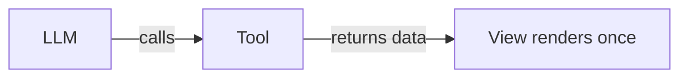

Best for: Static content, reports, single-result lookups.
Tools: 1 model-visible tool.

#### Pattern B: One-Shot + Interactive Refresh

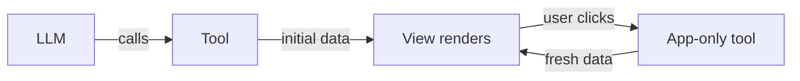

Best for: Dashboards with refresh, paginated lists, search results.
Tools: 1 model-visible + 1 app-only.

#### Pattern C: One-Shot + Chunked Loading

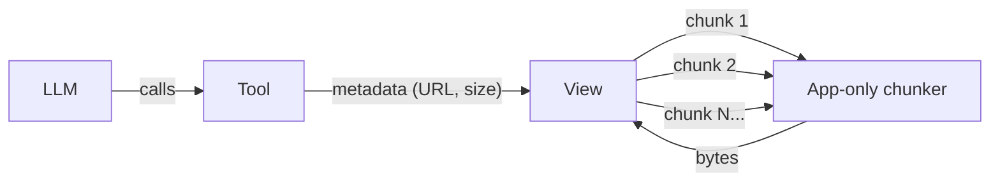

Best for: Large files (PDFs, images, datasets).
Tools: 1 model-visible + 1 app-only chunker.

#### Pattern D: One-Shot + Continuous Polling

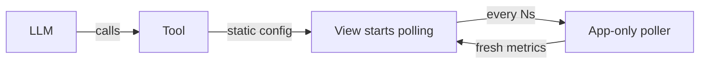

Best for: Monitoring, live status, real-time metrics.
Tools: 1 model-visible + 1 app-only poller.

#### Pattern E: Interactive Form Workflow

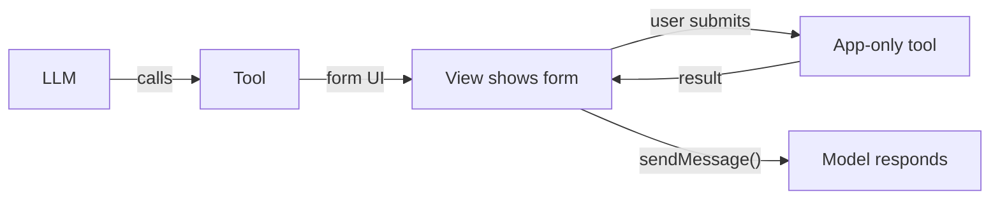

Best for: Checkout flows, settings forms, data entry, dangerous actions.
Tools: 1 model-visible + N app-only action tools.

#### Pattern F: Combined (Complex App)

Real apps often combine patterns. The PDF viewer uses:

- **One-shot** for initial metadata (`display_pdf`)
- **Chunked loading** for PDF bytes (`read_pdf_bytes`, app-only)
- **User-triggered** for page navigation (client-side, no tool call needed since data is loaded)
- **Model context updates** for page changes (`updateModelContext`)
- **Display mode switching** for fullscreen

The system monitor uses:

- **One-shot** for static system info (`get-system-info`)
- **Continuous polling** for live metrics (`poll-system-stats`, app-only, every 2s)

---

## 15. Display Modes

| Mode | Description |
|------|-------------|
| `inline` | Embedded in chat flow (default) |
| `fullscreen` | Takes over the full screen/window |
| `pip` | Picture-in-picture floating overlay |

### Declaring Support (View)

In `ui/initialize`, the View declares what it supports:

```typescript
const app = new App(
  { name: "My App", version: "1.0.0" },
  { availableDisplayModes: ["inline", "fullscreen"] }
);
```

### Requesting a Mode Change

```typescript
const result = await app.requestDisplayMode({ mode: "fullscreen" });
// result.mode may differ from what you requested
currentDisplayMode = result.mode;
```

### Responding to Mode Changes

```typescript
app.onhostcontextchanged = (ctx) => {
  if (ctx.displayMode) {
    if (ctx.displayMode === "fullscreen") {
      document.body.classList.add("fullscreen");
    } else {
      document.body.classList.remove("fullscreen");
    }
  }
};
```

---

## 16. Checking Client Support

Not all hosts support MCP Apps. Check at runtime:

```python
from fastmcp import Context
from fastmcp.server.apps import AppConfig, UI_EXTENSION_ID

@mcp.tool(app=AppConfig(resource_uri="ui://my-app/view.html"))
async def my_tool(ctx: Context) -> str:
    if ctx.client_supports_extension(UI_EXTENSION_ID):
        return rich_json_for_ui()
    else:
        return plain_text_fallback()
```

Always provide a meaningful `content` array even when UI is available — it's the fallback for non-UI hosts.

---

## 17. Common Patterns & Recipes

### Pattern: Tool + View + App-Only Refresh

```python
RESOURCE_URI = "ui://dashboard/view.html"

# LLM calls this to show the dashboard
@mcp.tool(app=AppConfig(resource_uri=RESOURCE_URI))
def show_dashboard(metric: str) -> dict:
    data = fetch_metric(metric)
    return {
        "content": [{"type": "text", "text": f"Showing {metric} dashboard"}],
        "structuredContent": data,
    }

# User clicks "Refresh" in the UI — LLM never sees this tool
@mcp.tool(app=AppConfig(resource_uri=RESOURCE_URI, visibility=["app"]))
def refresh_dashboard(metric: str) -> dict:
    data = fetch_metric(metric)
    return {
        "content": [{"type": "text", "text": "Refreshed"}],
        "structuredContent": data,
    }
```

### Pattern: View Persistence

Use `_meta.viewUUID` + localStorage to remember state across re-renders:

```python
# Server returns a unique ID per view
from uuid import uuid4

@mcp.tool(app=AppConfig(resource_uri=RESOURCE_URI))
def display_pdf(url: str, page: int = 1) -> dict:
    return {
        "content": [{"type": "text", "text": f"Displaying PDF: {url}"}],
        "structuredContent": {"url": url, "initialPage": page},
        "_meta": {"viewUUID": str(uuid4())},
    }
```

```typescript
// View-side: save/restore page
const viewUUID = result._meta?.viewUUID;
if (viewUUID) {
  const saved = localStorage.getItem(viewUUID);
  if (saved) currentPage = parseInt(saved);
}
// On page change:
localStorage.setItem(viewUUID, String(currentPage));
```

### Pattern: Model Context Screenshot

For visual tools, capture a screenshot and include it in model context:

```typescript
const canvas = document.querySelector("canvas");
const dataUrl = canvas.toDataURL("image/png");
const base64 = dataUrl.split(",")[1];

app.updateModelContext({
  content: [
    { type: "text", text: `Viewing page ${page} of "${title}"` },
    { type: "image", data: base64, mimeType: "image/png" },
  ],
});
```

Check `app.getHostCapabilities()?.updateModelContext?.image` first.

---

## 18. Project Structure

```
my-mcp-app/
├── server.py              # FastMCP server (tools + resources)
├── main.py                # Entry point (stdio/HTTP transport)
├── mcp-app.html           # HTML shell (Vite entry point)
├── src/
│   ├── mcp-app.ts         # Svelte mount point
│   ├── App.svelte         # Root Svelte component
│   ├── global.css         # Fallback CSS variables + resets
│   └── components/
│       ├── Loading.svelte
│       ├── Error.svelte
│       └── MainView.svelte
├── dist/
│   └── mcp-app.html       # Built single-file HTML (served as resource)
├── package.json
├── vite.config.ts
├── svelte.config.js
└── tsconfig.json
```

---

## 19. Limitations & Gotchas

### Architecture Limitations

- **No direct View ↔ Server communication.** Everything goes through the Host.
- **No View ↔ View communication.** Each tool call gets its own isolated iframe.
- **No state persistence across sessions** (beyond localStorage in the iframe sandbox, which may be wiped).
- **Content is a single HTML string.** No multi-file serving. Bundle everything or use CDN.

### Host-Specific Differences

- **ChatGPT** exposes `structuredContent` to the model. MCP spec does not.
- **Container dimensions** vary wildly between hosts. Always test on your target.
- **Display mode support** varies. Not all hosts support fullscreen or pip.
- **Permissions** (camera, etc.) may be silently denied.

### Practical Gotchas

- **Tool size limits**: Some hosts limit tool response size. For large data, use chunked app-only tools.
- **CSP is deny-by-default**: Forgetting to declare `resource_domains` for a CDN script will silently fail.
- **`autoResize`**: The SDK's default auto-resize uses `ResizeObserver`. If you need fixed dimensions, disable it: `new App({...}, {}, { autoResize: false })`.
- **Race conditions**: The iframe may initialize before the tool result is ready. Always handle the loading → data → error states.
- **`ontoolresult` fires once**: For the initial tool call. Subsequent data comes from `callServerTool()` responses.
- **Model context overwrites**: Each `updateModelContext()` call replaces the previous one entirely.
- **Host may not send all CSS variables**: Always provide fallbacks in your CSS.

### What the LLM Cannot Do

- It cannot see user clicks, scrolls, or interactions in the iframe.
- It cannot read the DOM of the iframe.
- It cannot call `visibility: ["app"]` tools.
- It only knows what you tell it via `content` (tool results) and `updateModelContext`.

---

## 20. Dependencies Quick Reference

### Python (server)
```
fastmcp>=3.0.0rc2
```

### JavaScript (view)
```json
{
  "@modelcontextprotocol/ext-apps": "^1.0.0",
  "@modelcontextprotocol/sdk": "^1.24.0",
  "svelte": "^5.0.0",
  "vite": "^6.0.0",
  "vite-plugin-singlefile": "^2.3.0",
  "@sveltejs/vite-plugin-svelte": "^5.0.0"
}
```

### SDK Imports Cheat Sheet

```typescript
// View-side (iframe)
import { App, applyDocumentTheme, applyHostStyleVariables, applyHostFonts } from "@modelcontextprotocol/ext-apps";
import type { McpUiHostContext } from "@modelcontextprotocol/ext-apps";
import type { CallToolResult } from "@modelcontextprotocol/sdk/types.js";

// Server-side (Node.js) — if using the TS MCP SDK directly
import { registerAppTool, registerAppResource, RESOURCE_MIME_TYPE } from "@modelcontextprotocol/ext-apps/server";
```

```python
# Server-side (FastMCP)
from fastmcp import FastMCP, Context
from fastmcp.server.apps import AppConfig, ResourceCSP, ResourcePermissions, UI_EXTENSION_ID
from fastmcp.tools import ToolResult
```

---

## 21. JSON-RPC Messages Reference

### View → Host

| Method | Purpose |
|--------|---------|
| `ui/initialize` | Handshake — declares app capabilities |
| `ui/notifications/initialized` | Confirms initialization complete |
| `ui/notifications/size-changed` | Report content size change |
| `tools/call` | Call a server tool |
| `resources/read` | Read a server resource |
| `ui/message` | Send a chat message |
| `ui/update-model-context` | Update model's silent context |
| `ui/open-link` | Open URL in browser |
| `ui/request-display-mode` | Switch inline/fullscreen/pip |
| `notifications/message` | Log messages |

### Host → View

| Method | Purpose |
|--------|---------|
| `ui/notifications/tool-input` | Tool arguments (complete) |
| `ui/notifications/tool-input-partial` | Streamed partial arguments |
| `ui/notifications/tool-result` | Tool execution result |
| `ui/notifications/tool-cancelled` | Tool was cancelled |
| `ui/notifications/host-context-changed` | Theme, dimensions, etc. changed |
| `ui/resource-teardown` | About to remove the iframe |

---

## 22. Decision Checklist

When designing your MCP App, answer these:

| Question | Guidance |
|----------|----------|
| What does the LLM need to know? | → Put in `content` |
| What does the UI need to render? | → Put in `structuredContent` |
| Should the LLM be able to trigger this action? | → `visibility: ["model"]` or `["model", "app"]` |
| Is this a UI-only action (delete, refresh, paginate)? | → `visibility: ["app"]` |
| Does the data exceed ~100KB? | → Use chunked app-only tools |
| Does the app load external scripts/APIs? | → Declare in `ResourceCSP` |
| Should the user be able to go fullscreen? | → Declare `availableDisplayModes` |
| Does the host need to know what the user is doing? | → Use `updateModelContext()` or `sendMessage()` |
| Does the app need to work without UI support? | → Check `client_supports_extension()`, provide text fallback |

---

## 23. Claude Code Plugin for MCP Apps

If you're building MCP Apps with Claude Code, install the official plugin to get scaffolding and migration skills:

### Installation

```bash
/plugin marketplace add modelcontextprotocol/ext-apps
/plugin install mcp-apps@modelcontextprotocol-ext-apps
```

### Skills

Once installed, you can ask Claude Code to:

**Create MCP App** — Scaffolds a new MCP App with server, view, build config, and CSP setup:

- "Create an MCP App"
- "Add a UI to an MCP tool"
- "Build an interactive MCP View"
- "Scaffold an MCP App"

**Migrate from OpenAI** — Converts OpenAI Apps SDK projects to MCP Apps:

- "Migrate from OpenAI Apps SDK"
- "Convert OpenAI App to MCP"
- "Port from window.openai"